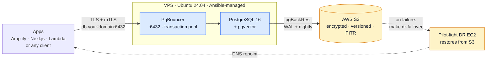

# pgfleet

Infrastructure-as-code for a self-hosted **PostgreSQL 16** that serves multiple projects.
Runs on any **Ubuntu 24.04 VPS**, consumed by serverless apps (AWS Amplify / Next.js / Lambda)
or any client. PgBouncer transaction pooling, pgvector, pgBackRest → S3 backups with PITR,
**pilot-light** on-demand disaster recovery, and Grafana Cloud monitoring. **Region- and
provider-agnostic** — the reference deployment is an OVH VPS + AWS `eu-central-1`, but any VPS
and any AWS region work; you set yours in config.

> **What this repo is:** everything needed to stand the database up — and stand it back up
> elsewhere — as code. **Ansible** configures the machines; **CloudFormation** provisions
> the AWS pieces. Design rationale (validated against primary sources, 2026) is in `docs/`.

## How it's built
| Concern | Tool | Where |
|---|---|---|
| Configure the VPS + DR EC2 (identical) | **Ansible** | `ansible/` |
| S3 bucket + IAM user for backups (persistent) | **CloudFormation** | `cloudformation/backup-infra.yaml` |
| On-demand DR EC2 (ephemeral, ~$0 idle) | **CloudFormation** | `cloudformation/dr-oncall.yaml` |
| The runtime itself | **Docker Compose** | rendered by Ansible to `/opt/db-server/docker/` |
| Secrets | **Ansible Vault** | `ansible/group_vars/all/vault.yml` (encrypted) |



## Layout
```
ansible/          Source of truth: roles + playbooks + (encrypted) vault. See docs/ansible.md
cloudformation/   backup-infra.yaml (S3+IAM, persistent) · dr-oncall.yaml (DR EC2, on-demand)
scripts/          dr-failover.sh · dr-teardown.sh (DR) · test-db-connection.sh (per-project smoke-test)
docs/             Design docs + runbook + Ansible guide
grafana/          Grafana Cloud dashboards/alerts inputs
```

---

## Quick start

Setup is driven by **`make`** from the repo root — run bare `make` to list every target. Every
personal value is a placeholder you fill into **gitignored** copies; the `Makefile` itself is
generic and carries no secrets.

### 1. Get the code & configure
```bash
git clone https://github.com/<you>/pgfleet.git && cd pgfleet
ansible-galaxy collection install -r ansible/requirements.yml
pip install boto3 botocore          # community.aws needs it (cert → Secrets Manager push)

# Fill these in — every real file below is gitignored:
cp ansible/group_vars/all/vault.example.yml ansible/group_vars/all/vault.yml   # secrets, then encrypt:
ansible-vault encrypt ansible/group_vars/all/vault.yml
cp ansible/group_vars/all/vars.example.yml  ansible/group_vars/all/vars.yml    # domain, region, projects[]
cp ansible/inventory/hosts.example.yml      ansible/inventory/hosts.yml        # your VPS IP
mkdir -p private && cp config.example.mk    private/config.mk                  # region/zone/IP/account for `make`
```
> You bring a **domain in a Route 53 hosted zone** and an **AWS account**. Any AWS region works —
> just set the **same** region in `vars.yml` and `private/config.mk`. Your real IDs live only in
> gitignored `private/config.mk`.

### 2. Order a VPS
Any **Ubuntu 24.04 LTS** VPS — any provider, any region. Note its IP → put it in `hosts.yml` and
`private/config.mk`. Nothing else by hand; Ansible takes over.

### 3. Provision the AWS backup infra (once)
```bash
make backup-infra      # S3 bucket + scoped IAM user + the db.<domain> DNS record (CloudFormation)
make outputs           # copy BackupBucketName → backup_s3_bucket in vars.yml, and put the IAM
                       # creds (Secrets Manager db-server/ovh-aws-creds) into your vault
```

### 4. Build the database
```bash
make site              # host prep → TLS/CA → Postgres + PgBouncer → projects → backups → monitoring → client certs
make dns               # confirm db.<your-domain> resolves to your VPS
```
That converging run also issues **one mTLS client cert per project** and uploads each to Secrets
Manager (`db-server/<project>/db-client`). Run one phase with `make tags T=<phase>`; issue a cert
for an extra role with `make issue-cert CN=<role>_app`.

### 5. Wire your apps
```bash
make dev-env PROJECT=<name>     # local Next.js/Prisma: writes client cert/key + .env.local
make dbeaver PROJECT=<name>     # same, plus the DBeaver connection fields
```
Amplify / serverless: [docs/amplify-nextjs-setup.md](docs/amplify-nextjs-setup.md) (Prisma 7, mTLS). DBeaver: [docs/dbeaver-setup.md](docs/dbeaver-setup.md).

### 6. Disaster recovery (set up once; run on failure)
Pilot-light, ~$0 idle. Fill `private/dr.env`, then `make dr-failover` (recover with
`make dr-teardown`). See [docs/runbook-failover.md](docs/runbook-failover.md).

> **Sharing:** push via **git** — a clone excludes your gitignored `vault.yml` / `vars.yml` /
> `hosts.yml` / `private/`. Don't zip the working dir. Full step-by-step:
> [docs/SETUP-CHECKLIST.md](docs/SETUP-CHECKLIST.md). Licensed under [MIT](LICENSE).

---

## Cost (AWS portion)
Idle ≈ **$2/mo** (S3 backup storage only). The DR EC2 bills only during an actual failover.
OVH VPS and Grafana Cloud are separate (Grafana free tier).

## Docs
| Doc | What |
|-----|------|
| [ansible.md](docs/ansible.md) | **How the automation works** — roles, vault, commands |
| [database-architecture.md](docs/database-architecture.md) | Core design: pooling, tuning, isolation, networking, backups, DR, DNS |
| [amplify-nextjs-setup.md](docs/amplify-nextjs-setup.md) | Per-project app wiring (Prisma 7, mTLS) |
| [dbeaver-setup.md](docs/dbeaver-setup.md) | Connect to a project DB from DBeaver (mTLS, PKCS#8 key) |
| [operations-deployment-monitoring.md](docs/operations-deployment-monitoring.md) | Docker + monitoring background + **connection smoke-test** (Part C) |
| [runbook-failover.md](docs/runbook-failover.md) | What to do when the DB is down |
| [grafana/SETUP.md](grafana/SETUP.md) | Grafana Cloud dashboards + alert rules |

## ⚠️ Secrets
Never commit the decrypted `vault.yml`, your filled-in `vars.yml` / `hosts.yml`,
`ansible/.vault_pass`, `ansible/files/ca/`, or host-rendered `docker/certs/` / `.env` —
all gitignored. Commit only the `*.example.yml` templates.
